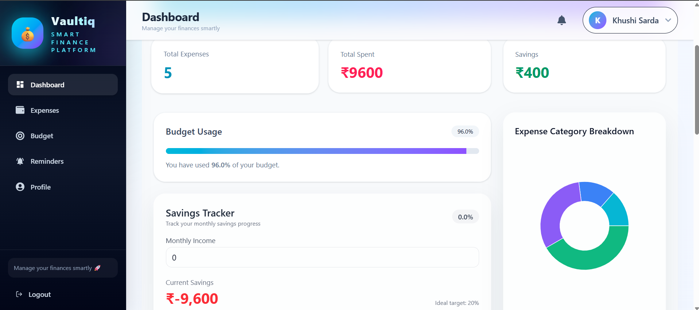
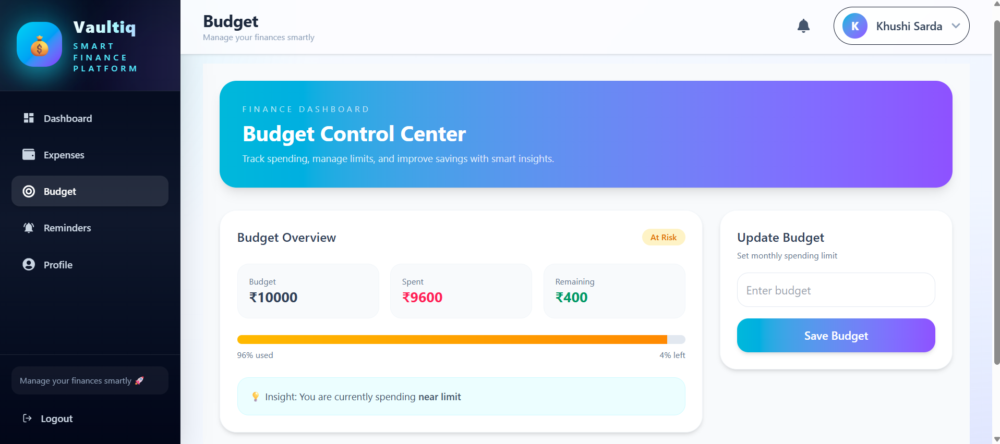
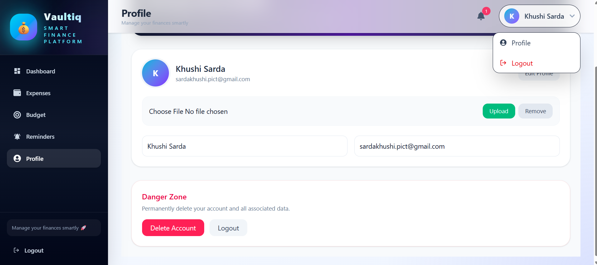
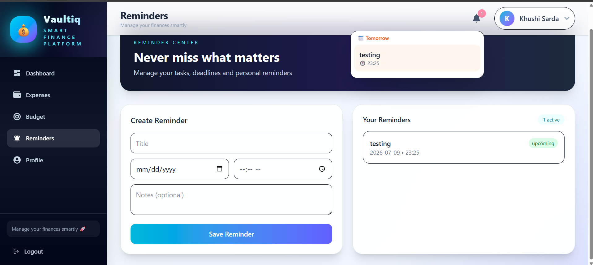

# 💰 "Vaultiq"-Smart Finance Platform (MERN Stack)

A modern full-stack **Expense Tracking & Financial Analytics Platform** built using the MERN stack (MongoDB, Express, React, Node.js).

This project helps users manage expenses, track budgets, analyze spending patterns, and improve financial discipline using real-time analytics and a clean, modern UI.

It is designed with a **production-level architecture, scalable backend structure, and SaaS-style UI/UX system**.

---

# 🚀 Live Demo
https://your-live-link.com

---

# 📸 Screenshots

| Dashboard | Budget | Profile | Reminders |
|----------|--------|----------|------------|
|  |  |  |  |

---

# ✨ Key Highlights

- 📊 Real-time financial analytics dashboard
- 💸 Expense tracking with category system
- 📉 Budget vs spending comparison
- 🧠 Smart savings calculation engine
- 🔔 Reminder & notification system
- 👤 Secure authentication (JWT-based)
- 📱 Responsive modern UI design
- ⚡ Optimized REST API architecture

---

# 🏗️ System Architecture

Frontend (React + Vite)
↓
Axios API Layer
↓
Backend (Node.js + Express)
↓
JWT Authentication Middleware
↓
Controllers (Business Logic Layer)
↓
MongoDB Database

---

# 🔐 Authentication System

- User Signup & Login
- OTP verification via email
- JWT-based authentication
- Protected routes for security
- Secure logout system

---

# 💰 Expense Management

- Add new expenses
- Edit existing expenses
- Delete expenses
- Category-based classification
- Recent expense tracking
- Real-time dashboard updates

---

# 📊 Budget System

- Monthly budget setup
- Live budget tracking
- Remaining budget calculation
- Overspending detection alerts
- Visual progress tracking

---

# 📈 Dashboard Analytics

- Total expense overview
- Category-wise breakdown (Pie Chart)
- Monthly expense trends
- Savings calculation
- Financial health insights

---

# 🔔 Reminder System

- Create reminders
- Edit reminders
- Delete reminders
- Notification bell system
- Today & tomorrow segmentation
- Auto cleanup of expired reminders

---

# 👤 Profile Management

- View profile details
- Update username & email
- Upload / remove profile picture
- Delete account permanently
- Secure session handling

---

# 🛠️ Tech Stack

## Frontend
- React.js (Vite)
- Tailwind CSS
- Recharts (Charts & Graphs)
- React Router DOM
- Axios
- React Toastify

## Backend
- Node.js
- Express.js
- MongoDB + Mongoose
- JWT Authentication
- Nodemailer (Email service)
- Multer (File uploads)
- Node-cron (Automation)

## Database
- MongoDB Atlas

---

# 🧠 Core Concepts Implemented

- REST API Architecture
- Authentication & Authorization (JWT)
- Middleware-based request handling
- File upload system (Multer)
- Data aggregation & analytics
- State management in React
- Component-based UI architecture
- Real-time UI updates

---

# 📁 Project Structure

Frontend/
├── components/
├── pages/
├── hooks/
├── services/
└── App.jsx

Backend/
├── controllers/
├── models/
├── routes/
├── middleware/
└── server.js

---

# 📊 Key Dashboard Metrics

- Total Expenses
- Category Breakdown
- Monthly Spending Trends
- Budget Utilization %
- Savings Calculation

---

# 🚀 Future Enhancements

- 🔔 Push Notifications (Web + Mobile)
- 🤖 AI-based spending insights
- 📊 Advanced analytics dashboard
- 🌙 Dark/Light mode toggle
- 📱 Mobile app (React Native)
- 💳 Income tracking module
- 📈 Investment tracking system
- 📤 Export reports (PDF/Excel)

---

# 👨‍💻 Author

**Khushi Sarda**

- GitHub: https://github.com/sardakhushi30-cloud  
- LinkedIn: (https://www.linkedin.com/in/khushi-sarda-699954337/)

---

# 📜 License

This project is developed for **educational and portfolio demonstration purposes only**.

---

# 💡 Why this project stands out

✔ Production-level architecture  
✔ Real-world financial use case  
✔ Scalable backend design  
✔ Advanced analytics dashboard  
✔ Clean and modern UI/UX  
✔ Full-stack end-to-end implementation  
✔ SaaS-ready structure

---

⭐ If you like this project, consider giving it a star on GitHub!